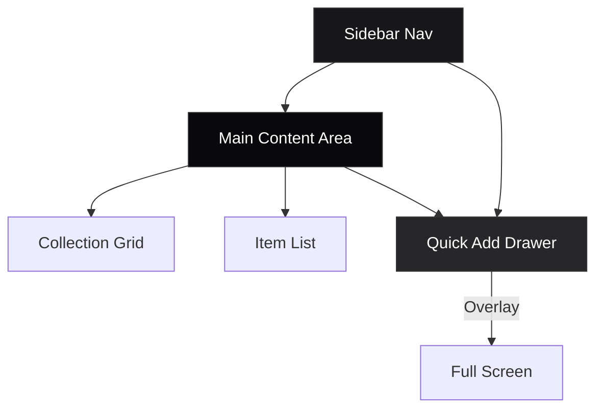

# 🚀 DevStash Project Overview

> **One fast, searchable, AI-enhanced hub for all developer knowledge & resources.**

## 📑 Table of Contents
- [🚀 DevStash Project Overview](#-devstash-project-overview)
  - [📑 Table of Contents](#-table-of-contents)
  - [1. Executive Summary](#1-executive-summary)
  - [2. User Personas](#2-user-personas)
  - [3. System Architecture](#3-system-architecture)
  - [4. Database Schema (Prisma)](#4-database-schema-prisma)
  - [5. Feature Specifications](#5-feature-specifications)
    - [A. Items \& Types](#a-items--types)
    - [B. Collections](#b-collections)
    - [C. Search](#c-search)
    - [D. AI Features (Pro)](#d-ai-features-pro)
    - [E. File Storage](#e-file-storage)
  - [6. UI/UX Design System](#6-uiux-design-system)
    - [Type System (Colors \& Icons)](#type-system-colors--icons)
    - [Layout Structure](#layout-structure)
    - [Micro-interactions](#micro-interactions)
  - [7. Monetization Strategy](#7-monetization-strategy)
  - [8. Tech Stack \& Resources](#8-tech-stack--resources)
  - [9. Development Guidelines](#9-development-guidelines)
    - [🛑 Critical Rules](#-critical-rules)
    - [📂 Project Structure](#-project-structure)
    - [🗓️ Phase 1 Roadmap (MVP)](#️-phase-1-roadmap-mvp)

---

## 1. Executive Summary

**Problem:** Developers suffer from context switching and lost knowledge due to scattered resources (snippets, prompts, docs, commands).
**Solution:** DevStash centralizes these assets into a unified, searchable, AI-enhanced workspace.
**Vision:** Become the "Second Brain" for developers, reducing friction between idea and implementation.

---

## 2. User Personas

| Persona | Needs | Key Value |
| :--- | :--- | :--- |
| **👨‍💻 Everyday Developer** | Fast access to snippets, commands, links. | Reduce lookup time, stop rewriting code. |
| **🤖 AI-First Developer** | Save prompts, contexts, system messages. | Optimize AI workflows, version control prompts. |
| **🎓 Content Creator** | Store code blocks, course notes, explanations. | Organize teaching materials efficiently. |
| **🏗️ Full-stack Builder** | Collect patterns, boilerplates, API examples. | Accelerate project scaffolding. |

---

## 3. System Architecture

High-level flow of data and interactions.

```mermaid
flowchart TD
    User[👤 User] -->|HTTPS| CDN[☁️ Cloudflare CDN]
    CDN --> Next[⚛️ Next.js App Router]
    
    subgraph "Application Layer"
        Next --> Auth[🔐 Auth.js v5]
        Next --> API[🔌 API Routes / Server Actions]
        API --> AI[🧠 OpenAI Service]
        API --> Storage[📦 Cloudflare R2]
    end
    
    subgraph "Data Layer"
        API --> Prisma[🦎 Prisma ORM]
        Prisma --> DB[🐘 Neon PostgreSQL]
        Prisma --> Cache[🔴 Redis (Optional)]
    end

    style User fill:#f9f,stroke:#333,stroke-width:2px
    style Next fill:#000,stroke:#333,stroke-width:2px,color:#fff
    style DB fill:#336791,stroke:#333,stroke-width:2px,color:#fff
```

---

## 4. Database Schema (Prisma)

*Note: Updated to match current stable versions (Prisma 6, Auth.js v5 standards).*

```prisma
// schema.prisma

generator client {
  provider = "prisma-client-js"
}

datasource db {
  provider = "postgresql"
  url      = env("DATABASE_URL")
}

// --- Authentication (Auth.js v5) ---
model User {
  id            String    @id @default(cuid())
  name          String?
  email         String?   @unique
  emailVerified DateTime?
  image         String?
  password      String?   // For credentials provider
  isPro         Boolean   @default(false)
  stripeCustomerId String?
  stripeSubscriptionId String?
  createdAt     DateTime  @default(now())
  updatedAt     DateTime  @updatedAt
  
  accounts      Account[]
  sessions      Session[]
  items         Item[]
  collections   Collection[]
  itemTypes     ItemType[] // Custom types created by user
}

model Account {
  id                String  @id @default(cuid())
  userId            String
  type              String
  provider          String
  providerAccountId String
  refresh_token     String? @db.Text
  access_token      String? @db.Text
  expires_at        Int?
  token_type        String?
  scope             String?
  id_token          String? @db.Text
  session_state     String?

  user User @relation(fields: [userId], references: [id], onDelete: Cascade)

  @@unique([provider, providerAccountId])
}

model Session {
  id           String   @id @default(cuid())
  sessionToken String   @unique
  userId       String
  expires      DateTime
  user         User     @relation(fields: [userId], references: [id], onDelete: Cascade)
}

model VerificationToken {
  identifier String
  token      String   @unique
  expires    DateTime

  @@unique([identifier, token])
}

// --- Core Domain ---

model ItemType {
  id          String   @id @default(cuid())
  name        String   // e.g., "Snippet", "Prompt"
  slug        String   @unique // e.g., "snippet", "prompt"
  icon        String   // Lucide icon name
  color       String   // Hex code
  isSystem    Boolean  @default(false) // Locks system types
  userId      String?  // Null for system types
  user        User?    @relation(fields: [userId], references: [id], onDelete: Cascade)
  items       Item[]
  
  @@unique([userId, name]) // Prevent duplicate custom types per user
}

model Item {
  id          String   @id @default(cuid())
  title       String
  description String?  @db.Text
  content     String?  @db.Text // For text-based items
  contentType String   // 'text' | 'file' | 'url'
  
  // File Specifics
  fileUrl     String?  // R2 Public/signed URL
  fileName    String?
  fileSize    Int?     // Bytes
  
  // Link Specifics
  url         String?  
  
  // Metadata
  language    String?  // e.g., "typescript", "bash"
  isFavorite  Boolean  @default(false)
  isPinned    Boolean  @default(false)
  
  createdAt   DateTime @default(now())
  updatedAt   DateTime @updatedAt
  userId      String
  user        User     @relation(fields: [userId], references: [id], onDelete: Cascade)
  
  typeId      String
  type        ItemType @relation(fields: [typeId], references: [id])
  
  collections Collection[] @relation("ItemCollections")
  tags        Tag[]        @relation("ItemTags")
  
  @@index([userId])
  @@index([typeId])
}

model Collection {
  id          String   @id @default(cuid())
  name        String
  description String?  @db.Text
  isFavorite  Boolean  @default(false)
  createdAt   DateTime @default(now())
  updatedAt   DateTime @updatedAt
  userId      String
  user        User     @relation(fields: [userId], references: [id], onDelete: Cascade)
  
  items       Item[]   @relation("ItemCollections")
  
  @@index([userId])
}

model Tag {
  id        String   @id @default(cuid())
  name      String
  userId    String
  user      User     @relation(fields: [userId], references: [id], onDelete: Cascade)
  items     Item[]   @relation("ItemTags")
  
  @@unique([userId, name])
}

// --- Join Tables (Explicit for addedAt metadata if needed) ---
// Note: Prisma implicit many-to-many is used above for simplicity. 
// If 'addedAt' per collection is strictly required, uncomment below:

/*
model ItemCollection {
  itemId       String
  collectionId String
  addedAt      DateTime @default(now())
  
  item       Item       @relation(fields: [itemId], references: [id], onDelete: Cascade)
  collection Collection @relation(fields: [collectionId], references: [id], onDelete: Cascade)
  
  @@id([itemId, collectionId])
}
*/
```

---

## 5. Feature Specifications

### A. Items & Types
*   **System Types:** Locked `ItemType` records seeded on deployment.
*   **Custom Types:** Pro feature allowing users to define new `ItemType` records linked to their `userId`.
*   **Creation:** Global `Command Palette` (Cmd+K) or Floating Action Button to open a **Drawer** for quick entry.

### B. Collections
*   **Many-to-Many:** Items can exist in multiple collections without duplication (logical relation).
*   **Visuals:** Collection cards display a dominant color based on the most frequent `ItemType` contained within.

### C. Search
*   **Implementation:** PostgreSQL Full-Text Search (`@@index([title, description])`) initially.
*   **Future:** Vector search (pgvector) for semantic AI search.
*   **Filters:** Filter by Type, Tag, Collection, Date.

### D. AI Features (Pro)
*   **Stack:** Vercel AI SDK + OpenAI (https://developer.puter.com/tutorials/use-vercel-ai-sdk-with-puter/).
*   **Models:** 
    *   *Standard:* `gpt-4o-mini` (Fast/Cheap for tags/summaries).
    *   *Complex:* `gpt-4o` (For code explanation).
*   **Endpoints:**
    *   `/api/ai/tagging`: Suggest tags based on content.
    *   `/api/ai/explain`: Generate markdown explanation of code snippet.
    *   `/api/ai/optimize`: Refine user prompts.

### E. File Storage
*   **Provider:** Cloudflare R2 (S3 Compatible, no egress fees).
*   **Security:** Presigned URLs for private files (Pro), Public URLs for shared snippets.
*   **Limits:** Enforced via middleware based on `User.isPro`.

---

## 6. UI/UX Design System

**Framework:** Tailwind CSS v4 + ShadCN UI
**Theme:** Dark Mode Default (Slate/Zinc Palette)

### Type System (Colors & Icons)
*Using Lucide React Icons*

| Type | Color (Tailwind) | Hex | Icon | Use Case |
| :--- | :--- | :--- | :--- | :--- |
| **Snippet** | `bg-blue-500` | `#3b82f6` | `<Code />` | Reusable code blocks |
| **Prompt** | `bg-violet-500` | `#8b5cf6` | `<Sparkles />` | AI System/User prompts |
| **Command** | `bg-orange-500` | `#f97316` | `<Terminal />` | CLI commands, scripts |
| **Note** | `bg-yellow-400` | `#fde047` | `<StickyNote />` | Text notes, docs |
| **File** | `bg-gray-500` | `#6b7280` | `<File />` | Configs, PDFs (Pro) |
| **Image** | `bg-pink-500` | `#ec4899` | `<Image />` | Screenshots, diagrams (Pro) |
| **Link** | `bg-emerald-500` | `#10b981` | `<Link />` | External resources |

### Layout Structure


### Micro-interactions
*   **Hover:** Cards lift slightly (`translate-y-[-2px]`) with shadow increase.
*   **Loading:** Skeleton screens matching content layout.
*   **Feedback:** Sonner Toast notifications for success/error states.
*   **Transitions:** `framer-motion` for drawer slides and page transitions.

---

## 7. Monetization Strategy

| Feature | 🟢 Free Tier | 🟣 Pro Tier ($8/mo) |
| :--- | :--- | :--- |
| **Items** | Max 50 | Unlimited |
| **Collections** | Max 3 | Unlimited |
| **File Types** | ❌ Disabled | ✅ Enabled (File/Image) |
| **Custom Types** | ❌ System Only | ✅ Custom Definitions |
| **AI Features** | ❌ Disabled | ✅ Auto-tag, Explain, Optimize |
| **Export** | ❌ Disabled | ✅ JSON/ZIP Backup |
| **Support** | Community | Priority Email |

*Implementation Note:* Use middleware to check `user.isPro` before allowing API routes for file uploads or AI endpoints.

---

## 8. Tech Stack & Resources

| Category | Technology | Documentation |
| :--- | :--- | :--- |
| **Framework** | Next.js 15 (App Router) | [nextjs.org](https://nextjs.org) |
| **Language** | TypeScript 5+ | [typescriptlang.org](https://typescriptlang.org) |
| **Database** | Neon PostgreSQL (Serverless) | [neon.tech](https://neon.tech) |
| **ORM** | Prisma 6 | [prisma.io](https://prisma.io) |
| **Auth** | Auth.js v5 (NextAuth) | [authjs.dev](https://authjs.dev) |
| **UI** | ShadCN UI + Tailwind v4 | [ui.shadcn.com](https://ui.shadcn.com) |
| **Storage** | Cloudflare R2 | [cloudflare.com/r2](https://cloudflare.com/r2) |
| **AI** | OpenAI (OpenAI gpt-5-nano) | [developer.puter.com/tutorials/free-unlimited-openai-api/#example-1-use-gpt-54-nano-for-text-generation](https://developer.puter.com/tutorials/free-unlimited-openai-api/#example-1-use-gpt-54-nano-for-text-generation) |
| **Payments** | Stripe Checkout | [stripe.com](https://stripe.com) |
| **Icons** | Lucide React | [lucide.dev](https://lucide.dev) |

---

## 9. Development Guidelines

### 🛑 Critical Rules
1.  **Database Migrations:** NEVER use `prisma db push` in production. Always use `prisma migrate dev` and `prisma migrate deploy`.
2.  **Environment Variables:** All secrets (API Keys, DB URLs) must be stored in `.env.local` and never committed.
3.  **Type Safety:** Strict TypeScript mode. No `any` types unless absolutely necessary (e.g., third-party lib gaps).
4.  **Security:** 
    *   Validate all inputs using `Zod`.
    *   Ensure Row Level Security logic in Server Actions (check `session.user.id` matches resource `userId`).
    *   Use Presigned URLs for R2 files to prevent hotlinking.

### 📂 Project Structure
```bash
/src
  /app            # Next.js App Router
  /components     # React Components (UI, Features)
  /lib            # Utilities (Prisma, Auth, AI, R2)
  /hooks          # Custom React Hooks
  /types          # TypeScript Definitions
  /styles         # Global CSS
/prisma           # Schema & Migrations
```

### 🗓️ Phase 1 Roadmap (MVP)
1.  [ ] Setup Next.js, Prisma, Neon, Auth.js.
2.  [ ] Implement User Auth (GitHub + Email).
3.  [ ] Build Core Schema (Items, Collections, Types).
4.  [ ] Create CRUD for Snippets & Links (Free tier).
5.  [ ] Implement Search & Filtering.
6.  [ ] Design Dashboard & Drawer UI.
7.  [ ] Integrate Stripe & Pro Gates.
8.  [ ] Add AI Features (Tagging/Summary).
